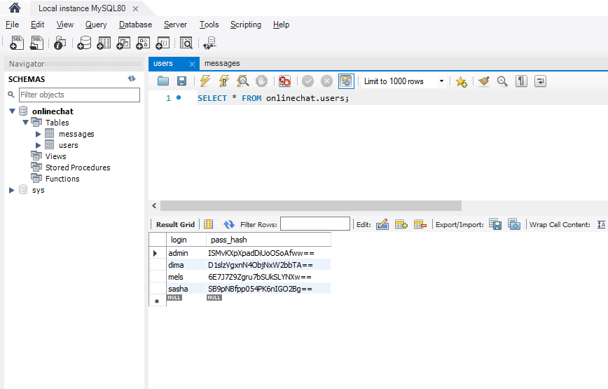
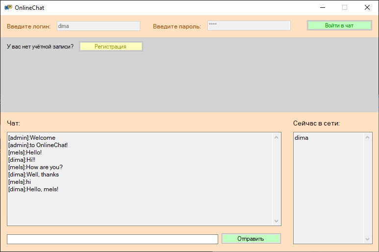
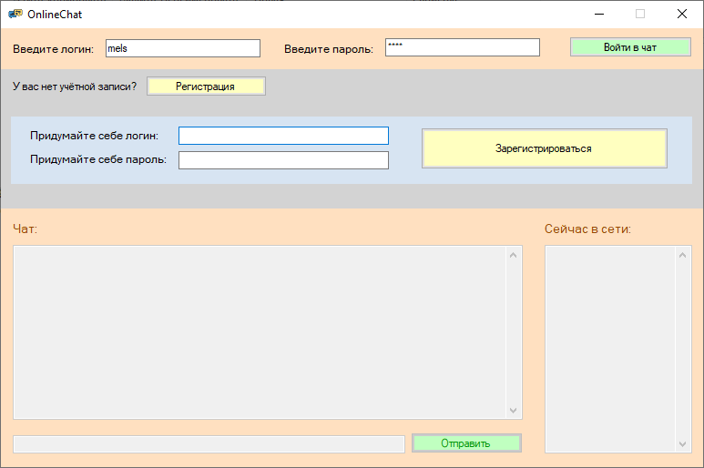
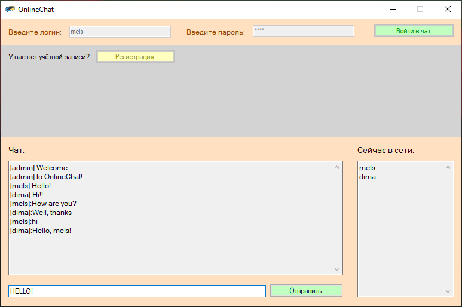
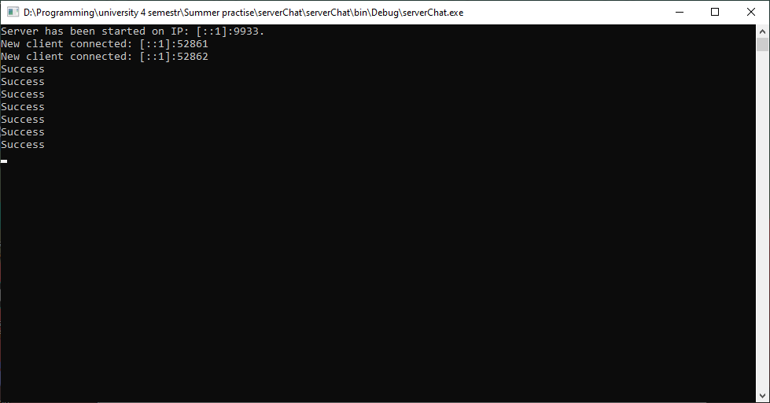

# Multi-user chat C#
Проект представляет собой написание многопользовательского чата на языке программирования С# с авторизацией и регистрацией пользователей и с сохранением данных о пользователях и сообщениях в базу данных MySQL  
## Описание программ и подключение библиотек

Написание многопользовательского чата с использованием технологии сокетов происходило в среде разработки Visual Studio 2019. Конечный результат состоит из клиентской и серверной частей.

### Клиентская сторона
Клиентское приложение было написано на языке программирования С# с использованием платформы пользовательского интерфейса Windows Forms. Платформа разработки Windows Forms поддерживает широкий набор функций для разработки приложений, включая элементы управления, графику, привязку данных и ввод пользователя. Характерной чертой Windows Forms является использование визуального конструктора с функцией перетаскивания в Visual Studio для упрощения создания приложений Windows Forms.

Были подключены следующие библиотеки:

Для работы с платформой Windows Forms
`using System.Windows.Forms;`

Для работы с технологией сокетов
`using System.Net.Sockets;`
`using System.Net;`

Для использования методов работы с текстами и строками
`using System.Text;`

Для работы с многопоточностью
`using System.Threading;`

Для использования методов хеширования
`using System.Security.Cryptography;`

Сама программа состоит их  двух классов Program и ChatForm. 

Класс Program является главным классом, с которого начинается выполнение программы, также в нём создаётся и отткрывается объект класса ChatForm. 

Класс ChatForm является формой, которая будет отображаться пользователю. В нём происходит подключение к серверу, а далее осуществляется обмен данными с сервером. Написаны методы для формирования сообщений серверу, методы, обрабатывающие ответы сервера, а также методы, касаемые пользовательского интерфейса, обрабатывающие события нажатия на ту или иную кнопку интерфейса. Также перед тем как отправлять пароль на сервер он хешируется с помощью метода хеширования md5().
### Серверная сторона
Сервер представляет собой консольное приложение, написанное на языке программирования С#. На сервере осуществляется подключение к базе данных MySQL, заранее установленной на носителе.
В программе сервер используются те же библиотеки, что и на клиенте (за исключением библиотеки Windows.Forms). А также ещё одна библиотека, в которой описаны методы и классы, позволяющие работать с удалённой базой данных MySQL из Visual Studio.
`using MySql.Data.MySqlClient;`

Для того чтобы мы могли использовать данную библиотеку сперва необходимо установить с# mysql connector с оффициального сайта MySQL. После чего в visual studio в обозревателе решений необходимо добавить ссылку, находящуюся на пути C:\Program Files (x86)\MySQL\MySQL Connector Net 8.0.29\Assemblies\v4.5.2 . Проделав всё это, мы можем подключить библиотеку MySql.Data.MySqlClient.

Программа сервер состоит из пяти классов:

Класс Program является главным классом, с которого начинается выполнение программы. В нём сервер начинает свою работу, инициализируется локальная конечная точка, которая связывается с созданным сокетом, после чего сервер ожидает подключения клиентов.

Класс Server является классом для работы с клиентами. В нём находится массив со всеми подключёнными на данный момент клиентами. Также описаны методы отключения старых и подключения новых клиентов, а ещё методы, обновляющие чат и список активных пользователей у всех клиентов. Ещё описан метод получения списка активных пользователей

Класс Client служит для работы с конкретным клиентом. В нём описаны методы для формирования сообщений клиенту, методы, обрабатывающие ответы сервера, а также методы, обновляющие чат и список активных пользователей у конкретного клиента.

Класс ChatController является классом для работы с чатом и сообщениями. В нём хранятся сообщения чата текущего сеанса, описаны методы подключения к базе данных для получения сообщений чата, методы добавления новых сообщений в базу данных. А также метод для получения сообщений текущего сеанса.

Класс DB служит для работы с удалённой базой данных MySQL. Подключение к базе данных осуществляется следующим образом (указывается хост, порт, имя и пароль пользователя и название базы данных): 
`MySqlConnection connection = new MySqlConnection("server=localhost;port=3306;username=root;password=3119750;database=onlinechat");`

Отдельно продемонстрирую пример выполнения подготовленного запроса к базе данных из кода:
```
DB db = new DB();
db.openConnection();
string sql = "INSERT INTO messages (user_login, message) VALUES (@uL,@uM)";
MySqlCommand command = new MySqlCommand(sql, db.getConnection());
command.Parameters.Add("@uL", MySqlDbType.VarChar).Value = userName;
command.Parameters.Add("@uM", MySqlDbType.VarChar).Value = msg;
command.ExecuteNonQuery();                                           
db.closeConnection();
```
Метод openConnection открывает соединение, далее создаётся объект типа MySqlCommand,  в конструктор которого при создании передаётся текст запроса и соединение, а после чего параметры в запросе связываются уже непосредственно с данными. Метод ExecuteNonQuery выполняет написанный нами запрос. В конце обязательно методом closeConnection закрывается соединение.
### Работа с потоками
При написании программ сервера и клиента использовались методы параллельного программирования. 
Для создания и запуска потока необходимо проделать следующие действия:
Объявляем и инициализируем объект типа Thread, в конструктор передаём функцию, которую должен будет выполнять поток
`Thread _serverThread = new Thread(startServer);`
Далее указываем, что поток будет фоновым
`_serverThread.IsBackground = true;`
После чего запускаем поток с помощью метода Start
`_serverThread.Start();`
### Работа с базой данных
На мой компьютер была установлена база данных MySQL Server 8.0, для работы с которой я использовал MySQL Workbench 8.0. 
В базе данных была создана схема onlinechat. После чего в данной схеме были созданы две таблицы:
Таблица users хранит в себе данные о пользователях, их логины и хеш их паролей. Код создания таблицы
```
CREATE TABLE users (
login VARCHAR(32) NOT NULL UNIQUE,
passHash VARCHAR(128) NOT NULL,
PRIMARY KEY (login)
);
```


Таблица messages хранит в себе информацию о сообщениях, от кого пришло сообщение и сам текст сообщения. Код создания таблицы
```
CREATE TABLE messages (
  id INT NOT NULL AUTO_INCREMENT,
  user_login VARCHAR(32) NOT NULL,
  message VARCHAR(256) NULL,
  PRIMARY KEY (id),
  INDEX login_idx (user_login ASC) VISIBLE,
  CONSTRAINT login
    FOREIGN KEY (user_login)
    REFERENCES users (login)
    ON DELETE NO ACTION
    ON UPDATE NO ACTION
);
```

## Работа программы
Работа приложения заключается в следующем: сначала запускается программа сервер, после чего запускаются программы клиент. В форме клиента предлагается ввести логин и пароль для входа в чат, если пользователь зашёл впервые, то ему предлагается зарегистрироваться. При авторизации и регистрации учтены всевозможные ситуации, когда что-то может пойти не по плану: пользователь не сможет зайти в чат, указав неверный логин или пароль, а также регистрация будет провалена, если пользователем с таким логином уже будет существовать. После успешной авторизации происходит «вход» в чат, где пользователь может начать обмениваться сообщениями с другими пользователями. Также при входе пользователю отображатся сообщения отправленные ранее и отобразится список активных пользователей.





